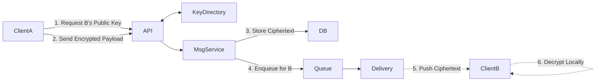
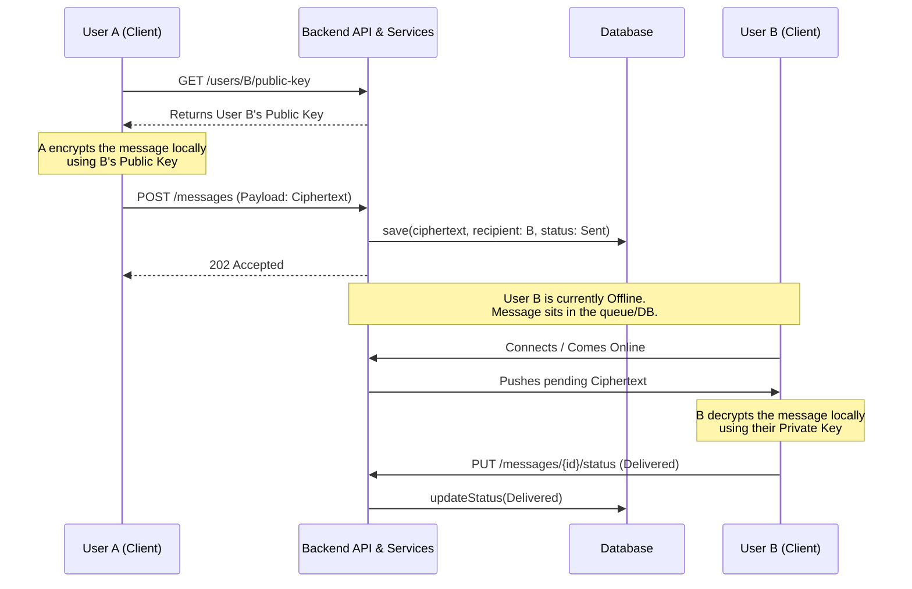
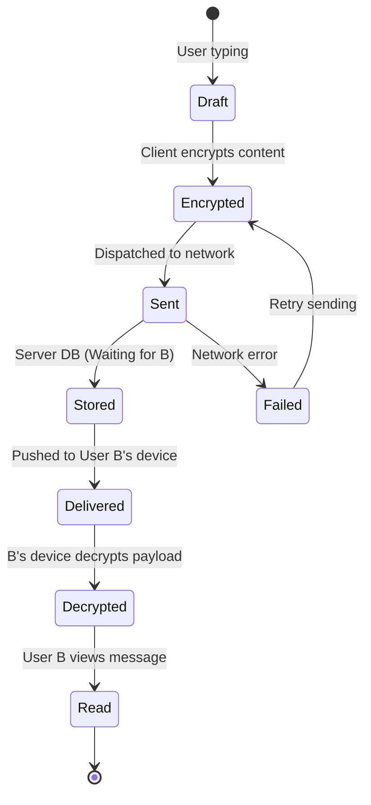

# 🧪 Laboratory Work 1: Variant 8
Зробив студент групи Б-121-24-3 ПІ
Рудий Іван Володимирович
## Designing a Messaging System
### 🎯 Goal
Learn how to:
- design software systems before coding;
- reason about architecture and responsibilities;
- use Component, Sequence, and State diagrams;
- document decisions using RFC and ADR.

---

## 🧠 Context

You are designing a minimal messenger system that supports:
- sending messages between users;
- asynchronous delivery;
- message statuses (sent / delivered / read);
- offline users.

---

## 🧩 Functional Requirements
1. A user can send a message to another user.
2. Each message has a lifecycle.
3. The system must:
  - store messages,
  - deliver them asynchronously,
  - update delivery status.
4. The recipient may be online or offline.

---

## 🧱 Part 1 — Component Diagram
In an E2EE system, we must introduce a Key Directory component. The server stores public keys, but the private keys never leave the clients.

### Task


---

## Part 2 — Sequence Diagram
This sequence illustrates the specific scenario requested: User A sends a message to User B, who is currently offline. Notice where the encryption happens to ensure the server never sees plain text.

### Task


---


## Part 3 — State Diagram
The lifecycle of an E2EE message contains unique states compared to a standard message, specifically regarding the encryption and decryption phases on the client edges.

### Task


---

## Part 4 — Architecture Decision Record (ADR)
```markdown
# ADR-002: Implementation of End-to-End Encryption (E2EE) for Direct Messaging

## Status
Accepted

## Context
We are designing a messaging system where user privacy and data security are the highest priorities.
The system must guarantee that the server, database administrators, or any intercepting third parties cannot read the content of the messages.
Furthermore, users can be offline at the time a message is sent to them, requiring temporary server-side storage of the message.

## Decision
  - We will implement asymmetric End-to-End Encryption (E2EE).

  - Clients will generate public/private key pairs locally.

  - Private keys will never leave the client device.

  - The server will host a Key Directory to distribute public keys.

  - Senders will fetch the recipient's public key, encrypt the message payload locally, and transmit only the ciphertext.

## Consequences
+ Guarantees absolute privacy of message content.
+ Protects against data breaches; compromised databases will only yield useless ciphertext.
- Increased complexity in client-side logic (key management, local storage, decryption).
- Potential for complete message loss if a user loses their device and hasn't backed up their private key.
```
